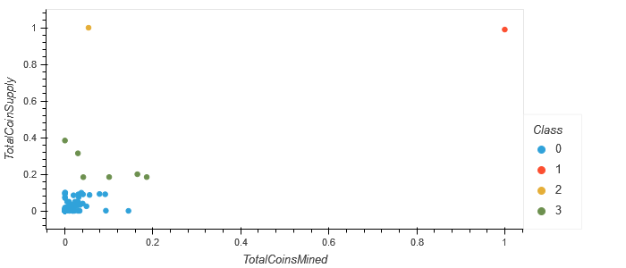

# Module 18 Challenge - Clustering Cryptocurrencies - Unsupervised Machine Learning

## Overview

The purpose of this analysis is to aid in creating a report that includes what cryptocurrencies
are on the trading market and how they could be grouped to create a classification system
for this new investment.

### Tasks

1. Preprocess and clean dataset.
2. Reduce Dimensions using Principal Component Analysis
3. Cluster Cryptocurrencies using K-means
4. Visualize Results in 3-D and 2-D Scatterplots

### Approach

Use an Unsupervised Machine Learning approach with a clustering algorithm to group the cryptocurrencies.

## Deliverables

### Deliverable 1

See `crypto_clustering.ipynb`

Note: My removal of trailing whitespace from entries in the `ProofType` field of `crypto_data.csv` resulted in 97 columns for the X DataFrame, rather than the 98 as shown in the provided Starter Code.
In the provided Starter Code, 'ProofType_PoW/PoS' appears twice as a column, because 'PoW/PoS' appears in the original unmodified source data as both 'PoW/PoS' and 'PoW/PoS '.

### Deliverable 2

See `crypto_clustering.ipynb`

### Deliverable 3

See `crypto_clustering.ipynb`

### Deliverable 4

See `crypto_clustering.ipynb`

## Results

At the end of the K-means analysis, the 532 Cryptocurrencies considered were clustered into Four (4) Classes.

This is best shown on the 2-D Scatterplot of Total Coins Mined vs. Total Coin Supply, with Coin Class differentiated
with color. It is shown here as Figure 1.

**Figure 1: Total Coins Mines vs. Total Coin Supply with Clusters Highlighted**

In summary, the Four Clusters consist of two outliers, and two clusters. One outlier with 100% of the Coins Mined with a Large Coin Supply (Class 1: 'BitTorrent'),
and one with a Large Coin Supply with a Small Amount of the Coins Mined (Class 2: 'TurtleCoin'). Implicit in their names is their respective
statuses: Torrents go fast and collide against their boundaries, Turtles go slow and steady towards the finish line, which can sometimes be
quite distant.

Beyond the outliers, there is a third diffuse cluster with Six (6) members who have either a Moderate Coin Supply, a Moderate Number of Coins Mined,
or both. (Class 3: 'EliteCoin', 'MoonCoin', 'ByteCoin', 'gCn Coin', 'Newton Coin', 'Qwertycoin')

The remaining 524 cryptocurrencies are members of cluster Class 0. They all have both a relatively Small Coin Supply, and a relatively Small Amount of the Coins Mined.

-- END --
